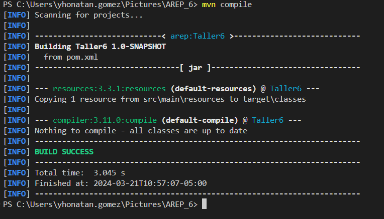

# Log Service System

## Descripción

El sistema de servicio de registro (Log Service System) es una aplicación diseñada para almacenar, actualizar y listar mensajes de log utilizando MongoDB como almacenamiento de datos. Está construido con Java usando el framework Spark para el backend y HTML/JavaScript para el frontend. Este sistema también implementa un patrón de fachada para acceder a múltiples servicios de registro de manera uniforme con la siguiente arquitectura.

## Cómo Ejecutar

### Requisitos Previos

- Java JDK 11 o superior
- MongoDB 4.0 o superior
- Maven para la construcción y gestión del proyecto

### Instrucciones

1. **Clonar el repositorio**: Primero que todo clonaremos el repositorio para así poder tenerlo localmente `https://github.com/YhonatanGoomez/AREP_6.git`.
2. **Compilar el Proyecto**: Nos dirigiremos a la carpeta en donde clonamos el repositorio y ejecutaremos el comando `mvn compile`.
 
3. **Docker**: Iniciamos la aplicación Docker Desktop y luego en el terminal ejecutamos el comando `docker-compose up` 
 
Vemos que se inicializa las instancias Docker
4. **Acceder a la Interfaz**: Abre un navegador y visita `http://localhost:37001/forms.html` para interactuar con el sistema.
 
4. **Creación de imagenes**: Vemos en DockerDesktop se crearon las imagenes exitosamente
 

## Docker HUB

Se crean los repositorios en Docker Hub para así subir las imagenes de Docker
 

Lanzamos el comando `docker images` para así saber cual imagen subiremos en el DockerHub y luego ejecutamos el siguiente comando dependiendo de las imagenes
`docker tag arep_6-logserv3:latest yhonatangomez/pruebas `
 
Y para subir la imagen al repositorio ejecutamos
`docker push yhonatangomez/pruebas:latest `
Vemos que es exitoso
 
Y así lo mismo para todas las imagenes

## AWS

Iniciamos el laboratorio para poder acceder a nuestra instancia.

Se crean todas las reglas necesarias para el funcionamiento porque es el unico que veremos desde otro equipo.
 

Construimos un nuevo docker-compose en AWS para así realizar un despliegue con las imágenes de DockerHub, sin embargo, todo esto se encuentra explicado en el video a continuación:

## Video

Adjunto el link al video.

https://youtu.be/pmyAQjGsPWU
